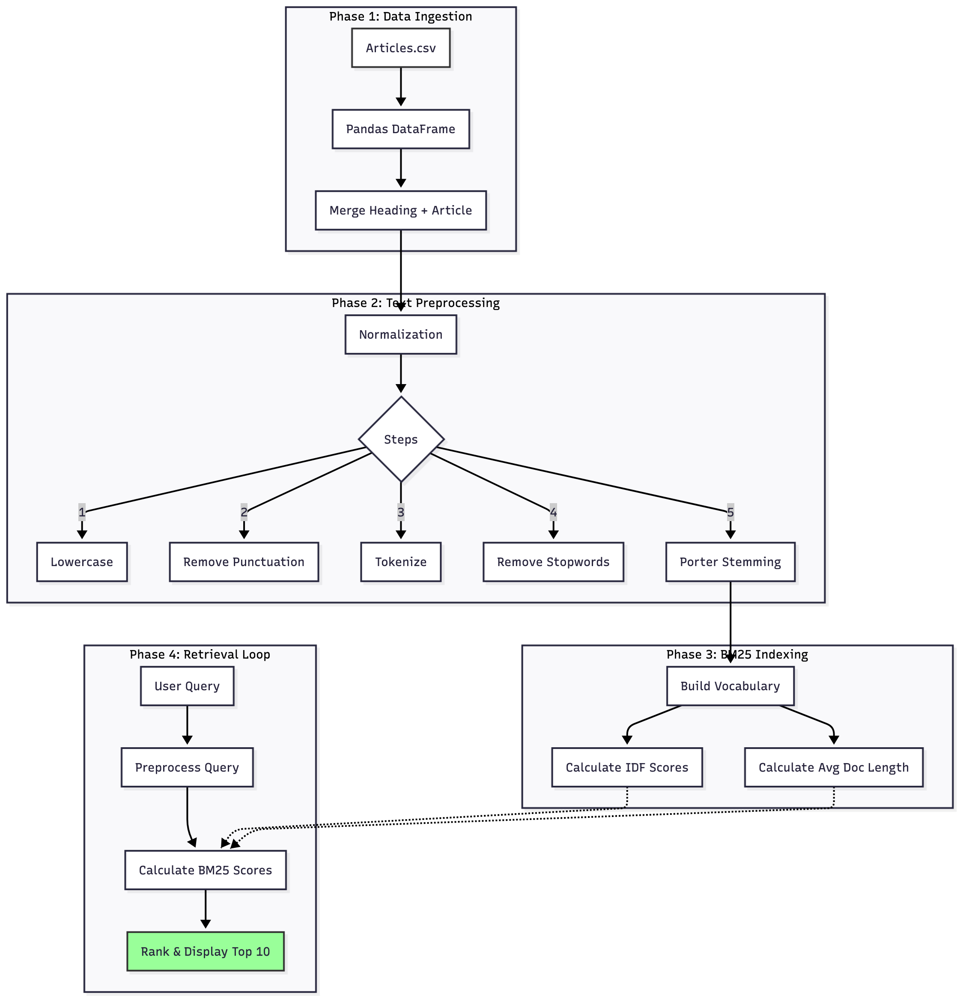

## IR-Assg-03

This is a local search engine project developed for the Information Retrieval course. It uses the BM25 algorithm to rank news articles based on keyword relevance. The system is designed to be lightweight and runs entirely locally.

### 📁 Project Structure

- main.ipynb - The main code file (Jupyter Notebook).

- Articles.csv - The dataset of news articles.

- requirements.txt - List of Python libraries needed.

- architecture_diagram.png - System design visualization.

###  🛠️ Prerequisites

Before running the code, ensure you have the following installed and some suggestions :

- Python 3.8+

- VS Code (Visual Studio Code) - Recommended IDE

- Jupyter Extension for VS Code (Search for "Jupyter" in the VS Code Extensions tab).

If you know about other methods that fine You just need to know how to run Jupyter notebook

### 🚀 Installation & Running 


Clone the project

```bash
  git clone https://github.com/EbadJunaid/IR-asg-03
```

Go to the project directory

```bash
  cd IR-asg-03
```

Install dependencies

```bash
  pip install -r requirements.txt

```
Now runs the Jupyter Notebook 
    


### 🔍 How to stop the code ? 

- Once the final cell runs, a search box will appear at the bottom.

- To Search: Type your query (e.g., petrol prices, Pakistan) and press Enter.

- To Stop: You must type the word `exit` and press Enter to finish the session.

Note: If you do not type `exit`, the cell will continue running, and you won't be able to run other cells.


### 🏗️ System Architecture

The following diagram illustrates the pipeline from Data Ingestion to Retrieval:



###  Output-Screenshot

For `query=cricket`

